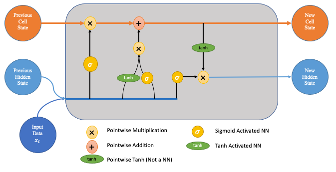

# Slogan Generation and Industry Classification — Neural Network–Based NLP

This project applies **neural network–based natural language processing (NLP)** techniques to build two complementary models: a slogan generator and an industry classifier. Using a dataset of business slogans and their associated industries, the analysis explores how sequence models can both **generate text** and **infer meaning from text**.

The project emphasises **clear structure, modular design, and interpretability**, prioritising functional end-to-end systems before extensive optimisation.

Architecture diagram sourced from “LSTM Networks – A Detailed Explanation”, Towards Data Science.

---

## What’s in this repository

- **Jupyter Notebook:** full capstone implementation (`neural_network_slogan.ipynb`)  
- **Dataset:** business slogans and industry labels (`slogan-valid.csv`)  
- **Images:** visualisations and reviewer feedback  
- **Requirements:** Python dependencies (`requirements.txt`)  

---

## Project Context

This capstone task focused on applying **sequential modelling techniques to a natural language processing problem**, providing experience with real-world NLP workflows.

The objective was to design a system capable of:

- generating business slogans conditioned on industry category  
- predicting the industry of a business given its slogan  
- combining both models to assess whether generated slogans could be correctly classified  

The task required careful text preprocessing, modular code design, and clear documentation throughout.

---

## Approach Overview

The analysis followed a structured NLP modelling workflow:

- Text cleaning and preprocessing  
- Tokenisation and sequence encoding  
- Vocabulary construction and indexing  
- Development of two neural network models:
  - a slogan generation model  
  - a slogan classification model  
- Modular function design to promote reuse and clarity  
- Evaluation of generated text and classification behaviour  
- Comparative analysis of generator and classifier outputs  

The focus throughout was on building reliable, interpretable pipelines rather than maximising performance prematurely.

---

## Key Insights / Findings

- Stable preprocessing and tokenisation pipelines were critical to achieving functional text generation.  
- Classification performance indicated that industry-specific linguistic patterns were being learned, even with limited training data.  
- Generated slogans were often syntactically plausible but semantically inconsistent, highlighting the challenges of small NLP datasets.  
- Passing generated slogans back through the classifier provided useful insight into where generative and discriminative models diverge.  

Overall, the project demonstrates both the potential and limitations of sequence models applied to constrained NLP problems.

---

## Endorsement

Reviewer feedback highlighted the **high quality and professionalism of the submission**, with particular praise for:

- **Highly readable code** with clear, descriptive variable naming  
- Strong adherence to **clean coding conventions**  
- Effective use of **modular functions** promoting reuse and maintainability  
- Inclusion of **docstrings** explaining function purpose, parameters, and outputs  
- Thoughtful organisation supporting debugging, extension, and long-term maintenance  

Overall feedback described the work as **clean, thoughtful, and well-structured**, noting that it demonstrates strong development habits and attention to maintainability.

---

## Skills Demonstrated

**Analysis**
- Text preprocessing and tokenisation  
- Interpretation of model outputs  

**Modelling**
- Neural networks for NLP  
- Sequence-based text generation  
- Text classification models  

**Evaluation**
- Qualitative assessment of generated text  
- Comparative analysis between generator and classifier  

**Tools**
- Python  
- TensorFlow / Keras  
- pandas  
- NumPy  
- Jupyter Notebook  

---

## Requirements

Install the required Python packages with: `pip install -r requirements.txt`

---

## Why this project belongs in my portfolio

This project demonstrates my ability to design, structure, and document a complete neural network–based NLP system.

Rather than focusing solely on performance metrics, the emphasis is on clean architecture, modular design, and interpretability, reflecting how machine learning systems are developed and maintained in practice. It complements my earlier deep learning work by extending neural networks into text-based modelling and highlighting the iterative nature of NLP development.

---

## Additional reading

The following article was particularly helpful in understanding Long Short-Term Memory (LSTM) architectures and informed both model design and interpretation:

LSTM Networks – A Detailed Explanation, Towards Data Science
https://towardsdatascience.com/lstm-networks-a-detailed-explanation-8fae6aefc7f9/
